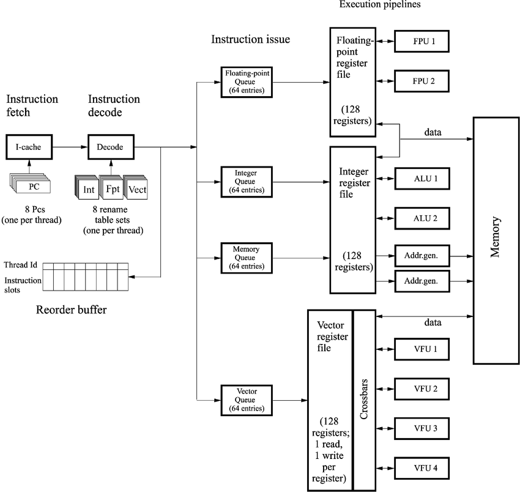

# C Pointers Hub

[← Back to C/C++ Core Sprint Hub](../hub_concepts.md) | [← Back to Exploration Plan](../../exploration_plan.md)

```c
int *p;
void* p;
```
## [Declaration parsing](pointer_declaration_parsing.md)
| Component | Parsing Rule | Priority |
| --- | --- | --- |
| **Postfix** (`[]`, `()`) | Array of $N$ / Function returning | Highest |
| **Prefix** (`*`) | Pointer to | Medium |
| **Far-Left Base Type** | Base data type | Lowest (evaluated last) |
| **Qualifiers** (`const`, `volatile`, `restrict`) | Binds to immediate left token (or right if far-left) | Modifies pointer vs. data mutability |

**Execution Steps:**

* Start at the **identifier**.
* Move **right** for arrays `[]` and functions `()`.
* Move **left** for pointers `*`.
* Unwind inner parentheses `)` and repeat.
* Finish at the **far-left base type**.


## Unified summary of `const`, `restrict` and `volatile`
| Feature / Aspect | `const` | `volatile` | `restrict` |
| --- | --- | --- | --- |
| **Core Assertion** | Target or pointer is **read-only** within the current scope. | Target can be modified **externally** outside normal execution flow. | Pointer has **exclusive access** to the referenced memory block (no aliasing). |
| **Target Application** | Variables, pointers, struct fields, function parameters/returns. | Variables, pointers, hardware register abstractions. | **Pointers only** (placed to the right of `*`). |
| **Compiler Impact** | Replaces scalar variables with immediate assembly operands (`MOV R0, #val`). | **Suppresses optimizations**: forces physical memory bus reads/writes on every access; disables load hoisting. | **Enables aggressive optimizations**: permits register caching, load elision, instruction reordering, and SIMD vectorization. |
| **Hardware / Memory Effect** | Directs global/static data to Flash/ROM (`.rodata`), preserving SRAM. | Enforces direct memory bus transactions per C statement; prevents register caching. | Pure compile-time alias assertion; generates zero direct runtime instructions. |
| **Syntax Placement** | Left of `*` for data (`const T *`), Right of `*` for pointer (`T * const`). | Left of `*` for data (`volatile T *`), Right of `*` for pointer (`T * volatile`). | Right of `*` only (`T * restrict`). |
| **Primary Use Cases** | Defensive API contracts, lookup tables (LUTs), immutable device configs. | MMIO registers, ISR flag variables, shared hardware/DMA buffers, `const volatile` counters. | High-performance array processing, math kernel design, `memcpy` implementations. |
| **Critical Pitfall / Misconception** | In C, `const` defines a **read-only lvalue**, not a true constant expression (ICE); can trigger VLAs. | **NOT atomic** (`v++` is still a multi-step Read-Modify-Write) and **NOT a CPU hardware memory barrier**. | Passing overlapping pointers violates the contract and results in silent **Undefined Behavior (UB)**. |


## [`const`](const.md)
* **C vs. C++ Semantics:** Defines a read-only *lvalue* (not a true compile-time constant); `const int N = 64;` triggers a VLA when sizing arrays.
* **Memory Routing:** Directs global/static data to Flash (`.rodata`) instead of SRAM (`.data`), preserving RAM.
* **Instruction Optimization:** Replaces scalar variables with immediate assembly operands (`MOV R0, #64`), bypassing memory bus reads entirely.
* **Interface Safety:** Enforces immutable API contracts across pointers, parameters, struct fields, and function returns.

## [`volatile`](volatile.md)
* **Core Function:** Forces the compiler to issue explicit bus/memory access instructions for every read or write in source code; suppresses register caching, dead store elimination, and loop-hoisting optimizations.
* **Pointer Variants:**
* `volatile int *p`: Referenced data changes externally (MMIO registers, ISR shared buffers).
* `int * volatile p`: Pointer address changes externally.
* `const volatile uint32_t *p`: Software read-only, hardware mutable (e.g., timer/counter registers).

| Feature | `volatile` Guarantee | What It Is NOT |
| --- | --- | --- |
| **Optimization** | Enforces physical bus reads/writes on every access | Not a CPU hardware memory barrier (doesn't prevent pipeline out-of-order execution) |
| **Operations** | Preserves sequential order of `volatile` accesses | **Not atomic** (`v++` still executes as a multi-step Read-Modify-Write sequence) |
| **Scope** | Manages hardware & async ISR side-effects | Not thread-safe for multi-threading (requires `stdatomic.h` or mutexes) |

## [`restrict`](restrict.md)
* **Core Purpose:** Developer assertion that a pointer has exclusive, non-aliased access to its memory block during its lifetime.
* **Compiler Optimization:** Eliminates redundant memory loads; enables register caching, instruction reordering, and SIMD vectorization.
* **Syntax Placement:** Placed to the right of `*` (e.g., `int * restrict p`), qualifying the pointer variable itself, not the base type.
* **Violation Risk:** Violating the non-aliasing contract results in Undefined Behavior (UB) without compile-time errors or warnings.

| Metric / Aspect | `memcpy` (`restrict`) | `memmove` (no `restrict`) |
| --- | --- | --- |
| **Aliasing / Overlap** | **Forbidden** (Buffers must be disjoint) | **Allowed** (Safe for overlapping regions) |
| **Performance** | Maximum speed (SIMD vectorization) | Slower (Requires overlap checks & directional copies) |
| **Overlap Result** | Undefined Behavior | Guaranteed correct execution |


## [`static`](static.md)

* **Storage Duration:** Relocates allocation from stack to static memory (`.data` for non-zero initialized, `.bss` for zero-initialized), persisting for full execution lifetime.
* **Linkage:** Alters symbol binding from `STB_GLOBAL` to `STB_LOCAL` in the ELF symbol table, hiding the identifier from other translation units (`.o`).


**Contextual Scope Matrix**

| Context | Storage | Linkage | Technical Behavior / Primary Purpose |
| --- | --- | --- | --- |
| **Function Local** | Static | None | Retains variable state across function calls without global namespace pollution. |
| **File Scope (Global)** | Static | **Internal** | Restricts symbol access strictly to current file; prevents duplicate symbol linker collisions (`LNK2005`). |
| **C++ Class Member Var** | Static | Class Scope | Allocates a single shared variable instance across all class objects in `.data`/`.bss`. |
| **C++ Class Member Func** | Executable (`.text`) | Class Scope | Executes without an implicit `this` pointer; signature matches standard C function pointers. |

**Language Extensions & Optimizations**

* **C99 `[static N]` Parameter:** Asserts to the compiler that an array parameter is **non-NULL** and contains **at least $N$ elements**, enabling SIMD vectorization and unrolled loads.
* **C++11 Magic Statics:** Guarantees thread-safe function-local static initialization via compiler-injected guard bytes (`__cxa_guard_acquire`).

**Critical Pitfalls**

* **Header File Inclusion:** Defining `static int x` in a `.h` file creates a separate, disconnected variable instance in every file that includes it.
* **ISR Reentrancy:** Function-local statics store state globally, breaking thread safety and ISR reentrancy. Use `_Thread_local` or explicit context handles instead.
* **Static Initialization Order Fiasco (SIOF):** Order of static object construction across distinct `.cpp` files is undefined; resolve via "construct-on-first-use" (local static inside a getter).

===

## 1. Pointer Arithmetic

Pointer arithmetic operates strictly in units of `sizeof(*p)`, not raw bytes. At the ISA level, the compiler injects a scale factor into address generation instructions.

```text
C Code:      p + i
Assembly:    Effective Address = Base_Address + (i * sizeof(*p))

```

* **Scaling Mechanics:** Adding `1` to `uint32_t *` increments the underlying byte address by `4`.
* **`ptrdiff_t`:** Subtraction of two pointers yields `ptrdiff_t` (signed integer type). Pointers must reference elements of the *same* array object (or one past the end); subtracting unrelated pointers is Undefined Behavior (UB).
* **The One-Past-The-End Rule (C11 §6.5.6p8):** Computing `&arr[N]` (where `arr` has `N` elements) is legally guaranteed by ISO C for relational comparisons (`p < &arr[N]`). Dereferencing `&arr[N]` causes immediate UB.
* **Out-of-Bounds Arithmetic:** Computing `p - 1` before the start of an array, or `p + N + 1` past the end, is UB **even if the resulting pointer is never dereferenced** (due to segment/register overflow optimizations on strict hardware architectures).
* **Null Pointer Arithmetic:** `(char *)NULL + 0` is strictly **UB** in ISO C. Modern compilers (`-O3`) leverage this to eliminate check branches surrounding memory operations.

---

## 2. Arrays vs. Pointers

Arrays and pointers are distinct types in the C type system that interact through *decay rules*.

```text
Array Object [int arr[5]]:   [ Element 0 ][ Element 1 ][ Element 2 ][ Element 3 ][ Element 4 ]
                             ^ 
Decayed Pointer [int *p]:    Points to Element 0 (Base Address)
Array Pointer [int (*ap)[5]]: Points to the ENTIRE 20-byte block (Different Stride!)

```

### Decay Exceptions

An array `T arr[N]` automatically implicitly converts (decays) to `T *` referencing `&arr[0]` in all contexts **except**:

1. `sizeof(arr)`: Yields total byte size (`N * sizeof(T)`), not pointer size.
2. `&arr`: Yields a pointer to the entire array (`T (*)[N]`), whose stride is `N * sizeof(T)`.
3. String literal initialization: `char str[] = "hello";` allocates stack array memory rather than a pointer to `.rodata`.

### Parameter Decoupling & Modern Qualifiers

In function parameters, array syntax is syntactically sugar-coated pointer declaration:

```c
void process(int arr[10]);     // Compiler converts to: void process(int *arr);
void process(int arr[]);       // Compiler converts to: void process(int *arr);
void process(int arr[static 10]); // C99: Guarantees 'arr' is NON-NULL and has AT LEAST 10 elements.
                                  // Allows compiler to emit SIMD unrolled loads safely.

```

---

## 3. Pointer-to-Pointer (`T **`)

A pointer-to-pointer stores the memory address of another pointer variable, introducing an extra level of indirection (two load instructions).

```text
Register / Stack         Memory Address A         Memory Address B
[ p2 ] ───────────────► [ p1 ] ────────────────► [ Data Object ]
(Holds Address A)        (Holds Address B)        (Value)

```

* **Indirection Decoupling:** Used to mutate local pointer references across function boundaries (e.g., dynamic heap allocation out-parameters: `void allocate(uint8_t **buf_out)`).
* **Multi-Dimensional Layout Illusion:** `T **` is **NOT** a 2D array (`T[M][N]`).

| Type | Memory Layout | Cache Locality | Allocation Overhead |
| --- | --- | --- | --- |
| `T arr[M][N]` | Single contiguous block (`M * N * sizeof(T)` bytes). | High (Sequential prefetching) | Single stack/heap allocation. |
| `T **ptr` | Array of pointers referencing disjoint memory blocks. | Poor (Pointer-chasing dereferences) | $M + 1$ heap allocations. |

* **The `const` Double-Pointer Hole:** Passing `char **` to a function expecting `const char **` is a compile-time type error in C. If allowed, it would let a function assign a `const char *` (pointing to `.rodata`) into a non-const table, enabling downstream code to write to read-only memory without explicit casts.

---

## 4. `void *` (Universal Object Pointer)

`void *` is a generic pointer to an unformatted byte sequence.

* **Implicit Conversions:** C permits implicit casting from `void *` to any object pointer type `T *` and vice versa (unlike C++).
* **Function Pointer Incompatibility:** ISO C strictly separates *object pointers* (`void *`) from *function pointers*. On architectures with distinct code and data buses (e.g., Harvard Architecture MCUs), conversion between `void *` and a function pointer is illegal.
* **POSIX Exception:** POSIX `dlsym()` mandates `void *` to function pointer conversion. The ISO C compliant workaround is: `*(void **)(&func_ptr) = dlsym(handle, "symbol");`.


* **Arithmetic Prohibition:** In pure ISO C, arithmetic on `void *` is illegal because `sizeof(void)` is incomplete.
* *GCC/Clang Extension:* Treats `sizeof(void) == 1`, allowing byte-wise offset arithmetic (`p + offset`). In portable C, cast to `uint8_t *` first.


---

## 5. Function Pointers

Function pointers store the execution entry point address of machine instructions in the code segment (`.text`).

```c
// Typedef signature: Function taking (int, char) returning double
typedef double (*MathFunc)(int, char); 

MathFunc fp = &my_function; 
double res = fp(42, 'a'); // De-references entry address and executes CALL instruction

```

```text
Function Pointer Table (Vtable pattern in C):
[ Struct Drivers ]
  ├──> read_fp  ─────► [ Driver_Read_ASM Assembly Routine ]
  └──> write_fp ─────► [ Driver_Write_ASM Assembly Routine ]

```

* **Calling Conventions & ABI:** Function pointers must match hardware ABI expectations (`__attribute__((stdcall))`, vector floating-point register conventions). A mismatch causes stack corruption or register corruption upon return.
* **Security & CFI:** Control Flow Integrity (CFI) protections (e.g., Clang CFI, ARM Pointer Authentication / PAC) validate that function pointers match target signatures before executing indirect branches to prevent Return-Oriented Programming (ROP) / Jump-Oriented Programming (JOP) exploits.

---

## 6. Alignment

Alignment mandates that memory addresses of data types must be an integer multiple of their size ($2^k$ boundary).

```text
Address:     0x00      0x01      0x02      0x03      0x04
           +---------+---------+---------+---------+---------+
Aligned:   |         uint32_t (4-Byte Word)        |  (Valid for 32-bit load)
           +---------+---------+---------+---------+---------+
Unaligned:           |        uint32_t (Offset 1)  |  (Hardware Fault or Multi-Cycle Penalty)

```

* **Hardware Impact:**
* Strict Alignment (e.g., ARM Cortex-M0): Unaligned accesses trigger a `HardFault` / `UsageFault`.
* Flexible Alignment (e.g., x86, ARM Cortex-M4): Unaligned accesses succeed but require multiple memory bus cycles and break atomic bus operations.


* **Compiler Struct Padding:** Compilers insert padding bytes between struct members to satisfy alignment rules. Reordering members by decreasing size minimizes padding overhead.
* **Explicit Control:**
* Alignment discovery: `_Alignof(type)` / `alignof(type)` (C11).
* Variable/Struct alignment: `_Alignas(64)` (e.g., aligning cache-lines to prevent false-sharing).
* Dynamic Memory Alignment: `aligned_alloc(alignment, size)` (C11) or `posix_memalign()`. Standard `malloc()` guarantees alignment suitable for `max_align_t`.


---

## 7. Aliasing & Strict Aliasing Rule

Aliasing occurs when two distinct pointer variables refer to the same physical memory location.

### Strict Aliasing Rule (C11 §6.5p7)

The compiler assumes that pointers of different underlying types **do not point to the same memory region**, enabling aggressive register caching across stores.

```c
void scale(int *i, float *f) {
    *i = 100;
    *f = 2.5f; // Compiler assumes writing *f DOES NOT overwrite *i
    // If strict aliasing holds, *i can be cached in a register and not reloaded from RAM.
}

```

### Permitted Type Aliasing Exceptions

An object's stored value may only be accessed by a pointer of:

1. A type compatible with the effective type of the object.
2. The signed or unsigned variant of the object type.
3. A character type (`char *`, `unsigned char *`, `uint8_t` if defined as `unsigned char`).

### Safe Type Punning Methods

```c
// METHOD 1: memcpy (Recommended - Optimized out entirely by LLVM/GCC to zero-cost instructions)
uint32_t raw_bits;
float f = 12.34f;
memcpy(&raw_bits, &f, sizeof(f));

// METHOD 2: Union Type Punning (Explicitly allowed in C99 TC3 / C11, BUT illegal in C++)
union {
    float f;
    uint32_t raw;
} converter = { .f = 12.34f };
uint32_t raw_bits = converter.raw; 

```

---

## 8. Object Lifetime & Effective Type

An object in C has an *allocation status*, a *storage duration*, and an *effective type*.

```text
Storage Durations:
├── Static:       Allocated at boot (.data/.bss), lasts entire program execution.
├── Thread:       Allocated per thread scope (_Thread_local).
├── Automatic:    Allocated on stack execution frame; destroyed on block exit.
└── Allocated:    Dynamic heap storage (malloc); lifetime explicitly managed via free().

```

* **Effective Type of Heap Storage (§6.5p6):** Heap allocation (`malloc`) returns untyped memory (`void *`). Its **Effective Type** is set dynamically upon the first write operation (e.g., via `*ptr = val` or `memcpy`). Future reads through incompatible pointer types violate strict aliasing.
* **Indeterminate Values & Trap Representations:** Uninitialized local variables contain indeterminate values. On CPU architectures with hardware state flags (e.g., IA-64 or strict parity check RAM), loading a trap representation into a register triggers an immediate hardware exception.

---

## 9. Dangling Pointers

A dangling pointer retains a memory address after the referenced object's lifetime has expired.

```text
Stack Frame Allocation:
  [ caller() ] ──calls──► [ get_buffer() ]
                             │  Creates: char stack_buf[32];
                             └──Returns: &stack_buf[0] ──┐
  [ caller() ] ◄─restores──── Stack frame pops           │
       │                                                 │
       └───► Accesses Dangling Pointer ──────────────────┘ (Stack Frame Overwritten!)

```

### Primary Root Causes

1. **Use-After-Free (UAF):** Accessing memory through a pointer after calling `free(p)`. The heap allocator may reassign the underlying chunk to another subsystem, causing cross-module data corruption.
2. **Stack Variable Escape:** Returning the address of an `automatic` stack variable from a function scope, or capturing an inner block variable address outside its `}` delimiter.
3. **Double Free:** Executing `free(p)` twice on the same pointer breaks heap metadata integrity (e.g., corrupting explicit free-list forward/backward pointers).

### Hardening Techniques

* **Defensive Zeroing Macro:**
```c
#define SAFE_FREE(ptr) do { free(ptr); (ptr) = NULL; } while(0)

```


* **AddressSanitizer (ASan):** Instruments code at compile time with shadow memory checks. Redzones are mapped around allocations; accesses to freed or out-of-bounds shadow bytes generate an immediate kernel abort trace.


# Bit Manipulation

---

### 1. Masks

Masks isolate specific bit groups using bitwise AND (`&`).

```c
uint32_t data = 0x0F0ACD11;
#define MASK_LAST_BYTE 0xFF // 0xFF extracts the full 8-bit byte (0x11)

uint8_t last_byte = data & MASK_LAST_BYTE; // 0x11

```

---

### 2. Set / Clear / Toggle

Bit modification uses explicit bit-shifts (`1U << N`).

```c
#define BIT_POS 4 // Bit position 4 (0x10)

// Set Bit N
*led |= (1U << BIT_POS);

// Clear Bit N
*led &= ~(1U << BIT_POS);

// Toggle Bit N
*led ^= (1U << BIT_POS);

// Read / Test Bit N
bool is_set = (*led >> BIT_POS) & 1U;

```

---

### 3. Bit Extraction

Extract a multi-bit field by shifting the field down to bit position 0 and masking the width.

```c
// Extract 4-bit field at offset 8 (bits 8..11) from 0x0F0ACD11 -> target is 0xD
#define FIELD_SHIFT 8
#define FIELD_MASK  0x0F // 4-bit mask

uint32_t data = 0x0F0ACD11;
uint8_t field = (data >> FIELD_SHIFT) & FIELD_MASK; // 0x0D

```

---

### 4. Bit Fields

Bit fields allow structure members to occupy explicit bit counts.

```c
typedef struct {
    uint8_t enable    : 1; // 1 bit  (0..1)
    uint8_t mode      : 3; // 3 bits (0..7)
    uint8_t error_code: 4; // 4 bits (0..15)
} HardwareFlags;

```

| Trait | Impact / Warning |
| --- | --- |
| **Memory Packing** | Implementation-defined. Compiler pads to word boundaries unless `__attribute__((packed))` is used. |
| **Bit Ordering** | LSB-to-MSB or MSB-to-LSB allocation is compiler and endianness dependent. |
| **Hardware MMIO** | **Non-portable** for hardware register mapping; prefer explicit shift/mask operations. |

---

### 5. Integer Promotion

Types smaller than `int` (`char`, `uint8_t`, `short`, `bool`) are automatically promoted to `int` (or `unsigned int`) before executing arithmetic or bitwise operations.

```c
uint8_t val = 0xFF;

// TRAP: ~val promotes 'val' to signed int (0x000000FF) before NOT operation
// Result of ~val becomes 0xFFFFFF00, NOT 0x00
if (~val == 0x00) { 
    // This condition evaluates to FALSE!
}

// FIX: Explicitly cast back to uint8_t
if ((uint8_t)~val == 0x00) {
    // Correctly evaluates to TRUE
}

```

---

### 6. Signed vs Unsigned Behavior

| Operation | Unsigned Types (`uint32_t`) | Signed Types (`int32_t`) |
| --- | --- | --- |
| **Right Shift (`>>`)** | **Logical Shift:** Always zero-fills high bits (`000...`). | **Arithmetic Shift:** Replicates sign-bit into high bits (implementation-defined prior to C23). |
| **Left Shift (`<<`)** | Wraps definedly modulo $2^N$. | Shifting a 1 into or past the sign bit causes **Undefined Behavior**. |
| **Sign Extension** | High bits filled with zeros on promotion. | Casting small signed negative types expands sign-bit across full word width. |

---

### 7. Endianness

Dictates the byte-ordering of multi-byte types in memory. Bit operations inside registers (`>>`, `<<`, `&`) are **always endian-independent**. Endianness only manifests when inspecting memory via byte pointers or union casts.

```text
Value: 0x12345678 at Address 0x1000

Memory Addr:   0x1000   0x1001   0x1002   0x1003
Little-Endian: [0x78]   [0x56]   [0x34]   [0x12]   (LSB at lowest address - x86, ARM default)
Big-Endian:    [0x12]   [0x34]   [0x56]   [0x78]   (MSB at lowest address - Network Order)

```

```c
// Runtime Endianness Detection
uint16_t check = 0x0001;
bool is_little_endian = (*(uint8_t *)&check == 0x01);

```

---

### 8. Overflow Behavior

```c
// Unsigned Overflow: Well-Defined
uint8_t u = 255;
u += 1; // Guaranteed to wrap to 0 (Modulo 2^8)

// Signed Overflow: UNDEFINED BEHAVIOR
int8_t s = 127;
s += 1; // UB! Compiler optimizations (-O3) assume this NEVER happens

```

* **Unsigned:** Guaranteed modulo arithmetic ($2^N$). Safe for wrap-around counters and checksum calculations.
* **Signed:** Overflow is strictly **Undefined Behavior (UB)**. Compilers leverage this UB assumption to optimize away bounds checks (e.g., assuming `i + 1 > i` is always true).


# Miscellaneous 
1. **Load elision**: Process of combining multiple load statements to one through compiler optimization.
2. **Why CPU registers are called register files?** Register file is an array of individual registers.

### Hardware Core Architecture & Register Files
Below is the execution pipeline architecture illustrating integer, floating-point, and vector register files alongside instruction queues and memory interfaces:



