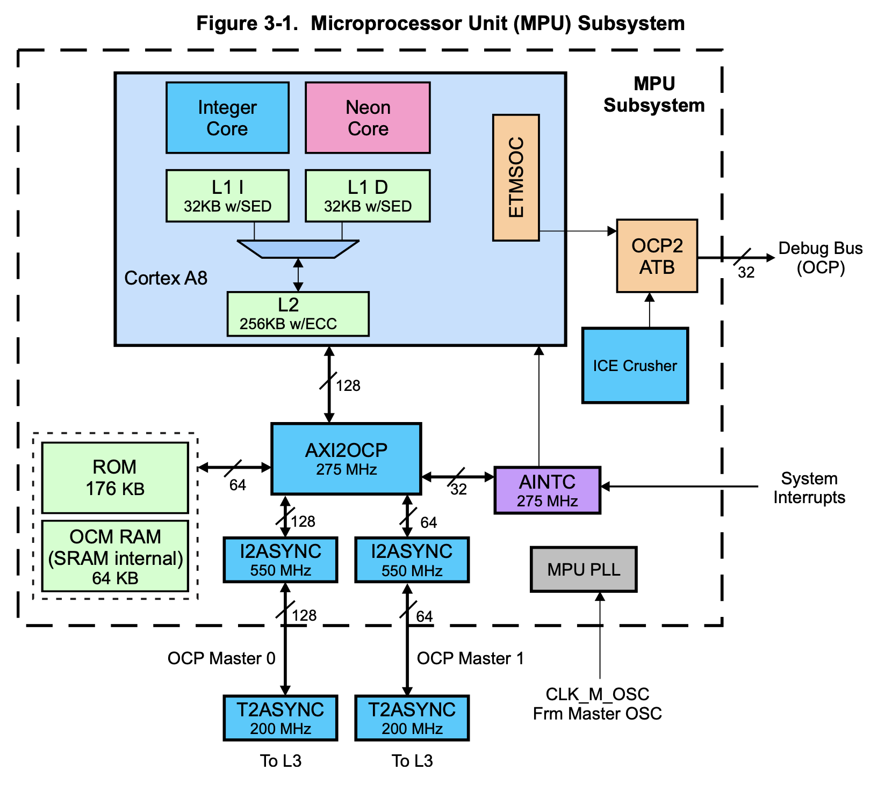
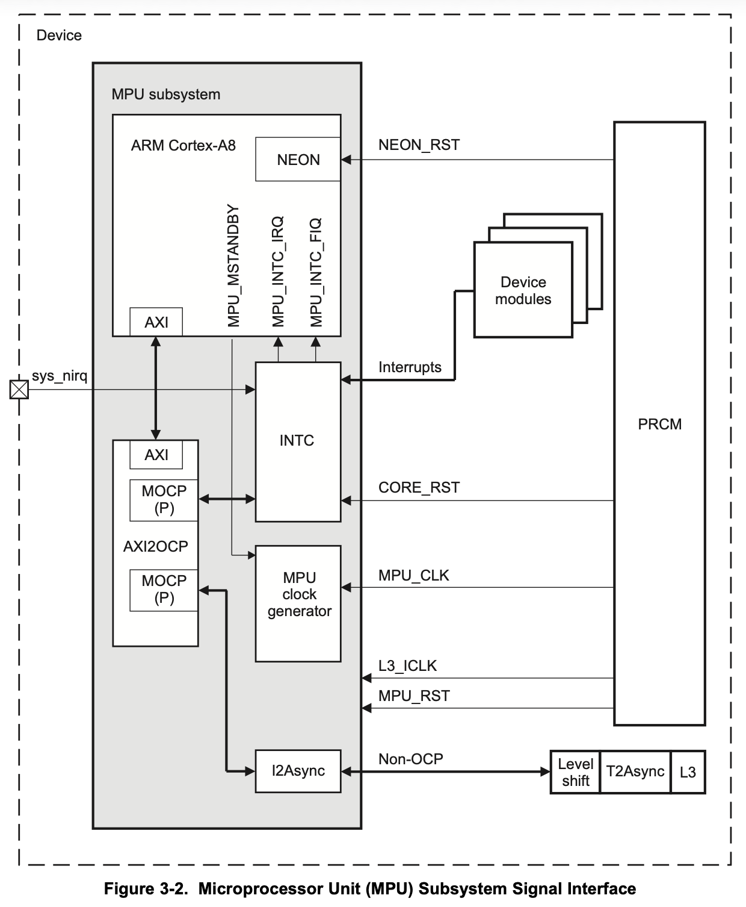
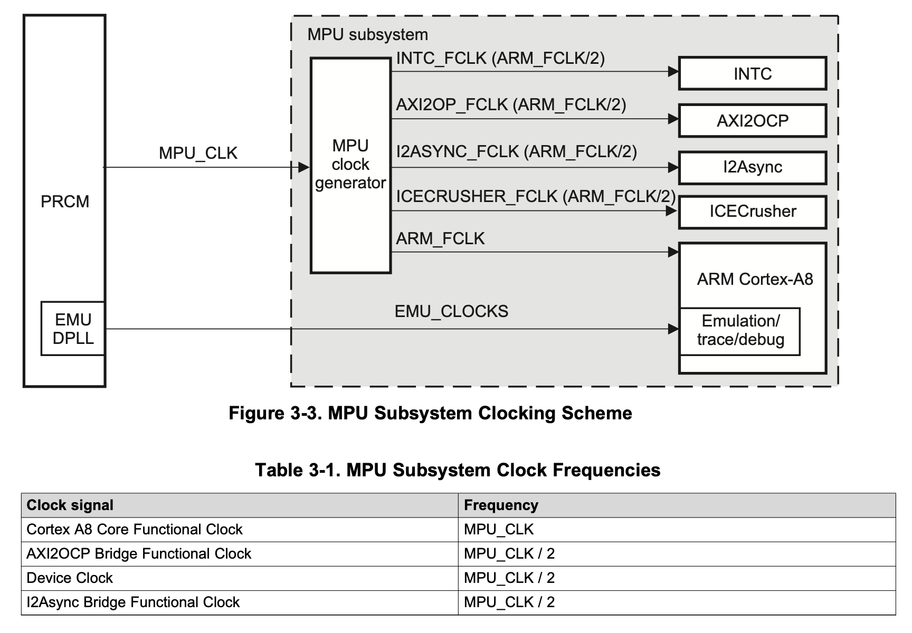
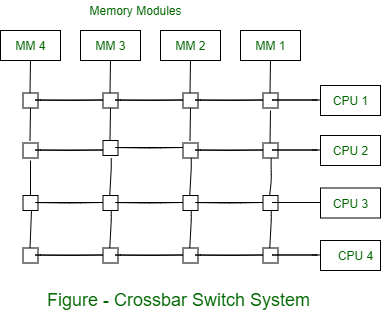

# Cortex A8 MPU subsystem

- Cortex A8
    - ARM v7 compatible 
    - 256KB L2 cache 
    - 32KB L1 instruction cache and 32KB L1 data cache
    - Includes Neon engine
    - Connect to MPU subsystem using 2 interconnects:
        - AXI2OCP interface : For peripheral interfacing
        - ETMSOC : For debug; supports OCP2; Debug emulation core
- Integrated 176KB ROM 
    - Connected to Cortex-A8 through AXI2OCP interconnect
- 64KB On Chip Memory(OCM) SRAM : Internal to MPU system
    - Connected to Cortex-A8 through AXI2OCP interconnect
- AINTC(Interrupt Controller)
    - Direct connection to Cortex-A8
    - Interfaced to AXI2OCP

- AXI2OCP
    - Supports OCP 2.2 and AXI
    - SIMD Protocol on two ports
    - Multiple targets including 3 OCP ports(128bit, 64bit and 32bit)
    - INTC is interfaced through OCP 
- Interrupt controller 
    - supports 128 interrupt requests
- Clock : Through PRCM

## I2Async and clock synchronization
- Cortex A8 runs at higher frequency, in range of 1GHz
- But the L3 subsystem is not capable of working at this high frequency. Hence we need an interface capable of bidirectional transfer of AXI/OCP instructions from high frequency core to L3 subsystem. 
- I2Async is exactly this subsystem

- INTC bypasses I2Async since hardware interrupts warrant for a high speed path between interrupt source and the core. 

## Clock and reset distribution
- Embedded DPLL(Digital PLL) is used 
- All major modules inside MPU subsystem are clocked at 1/2 the frequency of ARM core.
- CM_DIV_M2_DPLL_MPU.DPLL_CLKOUT_DIV : Register field for programming the divider; NOTE: frequency is relative to ARM clock

Generates following functional clocks:
1. ARM_FCLK : Core clock
    - Base clock routed to all functional blocks inside Cortex A8 core
    - ARM Core, Neon Core, ETM Core, L2 cache and other modules inside Cortex A8
    - Also routed to Internal RAMs
    - Highest frequency clock in the MPU subsystem. This is the ARM clock
2. AXI_FCLK : AXI2OCP CLock
    - Half the frequency of ARM_FCLK
3. MPU_INTC_FCLK : Interrupt Controller Functional Clock
    - Half the frequency of ARM_FCLK
4. ICECURSHER_FCLK : ICE-Crusher Functional Clock
    - Operates on APB bus
    - Half the frequency of ARM_FCLK
5. I2ASYNC_FCLK : I2Async clock
    - Half the frequency of ARM_FCLK
    - Clock for OCP interface of AXI2OCP

6. Emulation clocking
    - These are special cases
    - Distributed by PRCM module directly, instead of internal "MPU clock generator"
    - Can run at maximum 1/3 of ARM_FCLK

## AXI2OCP Interconnect
- Supports 128bit and 64bit wide inputs and output data buses
- Bus clock is synchronous with ARM_FCLK
### Crossbar Architecture Switched System

- Crosspoints: Intersection points in the matrix. A switch connects a specific input line to an output line at these cross points
- Arbitration logic: Control circuitry for handling simultaneous requests from multiple inputs; Priority based arbitration
- Multiplexers: Decide which input should be routed to which output; control input for the cross points
