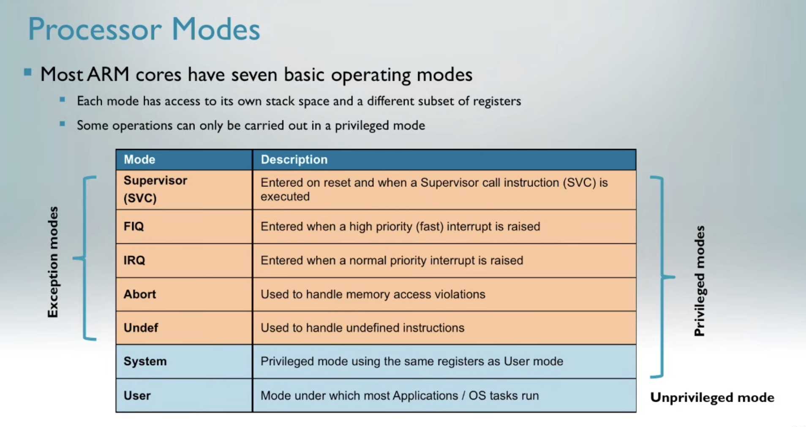
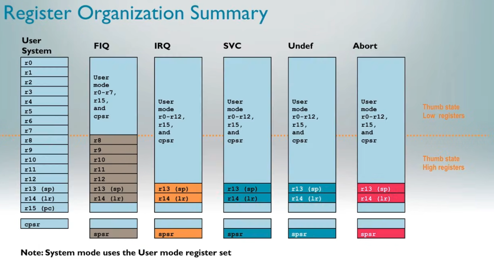

# ARM architecture 
- Von-neumann architecture 
    - Load-Store based

## Instruction set 
Supports two major types of instruction sets:
1. ARM instruction set
    - 32 bit
    - Supported by Cortex A architecture 
2. Thumb instruction set
    - 16bit in Thumb v1, 16/32 bit in Thumb v2 
    - Default instruction set for arm gcc compiled code
    - More efficient since it uses 16bit instructions whenever possible 
    - Supports Cortex A and M

- Most internal registers are 32 bits wide
- Word : 32 bits
- Half word : 16 bits (Thumb v1 is half word)
- Double word : 64 bits

## Processor operating modes
1. Cortex A supports 7 operating modes
    - Broadly classified as "privilaged" and "unprivilaged" modes

    - Except "User" mode, every other operating mode is privilaged 
    - Certain peripherals and memory addresses are only accessible in privilaged mode
    - Helps to isolate "user threads" from kernel and each other

2. Cortex M supports 2 operating modes: Supervisor and Thread

- When mode switch happen, certain registers banks are made available to the core, while others are made invisible. SP and LR are always swapped. SPSR stores the last CPSR value right before mode switch, so that processor can come back to the exact previous state after mode switch.

## Bus architecture
- AMBA APB for internal interconnects
- AMBA AXI for external interconnects 

There is an AMBA APB bridge connecting APB with AXI

- DEBUG interface is the only direct interaction point with the core for external world
