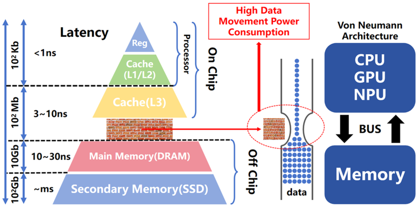

### 1. The Von Neumann System Bus Triad

| Bus | Physical Direction | Operational Role | Key Signals / Lines |
| --- | --- | --- | --- |
| **Address Bus** | Unidirectional (Master $\rightarrow$ System) | Selects specific RAM location or MMIO register. | $A[63:0]$ |
| **Data Bus** | Bidirectional | Transfers raw data payloads, instructions, and peripheral command words. | $D[63:0]$ |
| **Control Bus** | Point-to-point / Unidirectional lines | Manages electrical timing, read/write direction, arbitration, and device readiness. | `R/W#`, `READY#`, `CLK`, `IRQ` |

---

### 2. Memory Addressing Schemes: MMIO vs. PMIO

| Attribute | Memory-Mapped I/O (MMIO) | Port-Mapped I/O (PMIO) |
| --- | --- | --- |
| **Address Space** | Unified (I/O registers sit inside main memory space) | Isolated (Separate $64\text{ KB}$ I/O port address space) |
| **Instruction Set** | Standard memory instructions (`LOAD`, `STORE`, `MOV`) | Specialized port instructions (`IN`, `OUT`) |
| **Control Bus Line** | None required | Requires explicit `M/IO#` pin |
| **Primary Architectures** | ARM, RISC-V, MIPS, Apple Silicon | x86 / x86-64 |
| **Bus Decoding** | Top-level system decoder routes address ranges | CPU asserts `M/IO# = 0` to activate I/O port decoders |

---

### 3. Signaling Conventions & Interrupt Architecture

* **Active-Low Signaling (`#` / `_N` / overbar):** Asserted at $0\text{V}$ (Ground); Inactive at $V_{CC}$. Open-drain outputs with pull-up resistors enable multiple peripherals to share a single line without short circuits.
* **Interrupt Routing Pipeline:**
* *Hardware IRQ Lines:* Peripheral $\rightarrow$ Interrupt Controller (ARM GIC / x86 APIC) $\rightarrow$ CPU Core `INT` pin.
* *In-Band Interrupts (MSI/MSI-X):* Replaces physical IRQ pins by having peripherals write a vector message directly to a target RAM address over the Data Bus.

---

### 4. Runtime Directionality & Bus Arbitration

* **Tri-State Logic:** Pins operate in `0`, `1`, or **High-Z** (High Impedance / electrically disconnected).
* **Bus Transaction Contract:**
1. **Address Phase:** Master places address on Address Bus and asserts `READ` (`R/W# = 1`).
2. **Decode Phase:** Address Decoder asserts Chip Select (`CS#`) for the targeted device.
3. **High-Z Isolation:** Unselected devices maintain High-Z output(using tristate buffers) to prevent bus contention.
4. **Drive & Handshake:** Targeted device drives Data Bus lines and asserts `READY#`.
5. **Turnaround Cycles:** 1–2 clock cycles inserted when reversing bus direction (`READ` $\rightarrow$ `WRITE`) allowing active drivers to release to High-Z before new drivers engage.

---

### 5. The Von Neumann Bottleneck & Memory Wall

**Core Constraint:** Because instruction fetches and data operations share the same physical bus and address space, the CPU cannot read an instruction and access data concurrently over the system bus.

| Bottleneck Vector | Root Physical Cause | System Performance Impact |
| --- | --- | --- |
| **Bus Serial Phase Conflict** | Single shared physical data bus | CPU pipeline stalls whenever a data read/write preempts instruction fetching. |
| **Latency Disparity (Memory Wall)** | CPU clock speeds (~0.2 ns) vs. DRAM access latency (~50 ns) | CPU execution units spend up to 70–80% of execution cycles idle ("memory stalls"). |
| **Power Consumption Penalty** | Driving off-chip capacitive PCB traces | Data movement over physical buses consumes ~100x more energy than internal register ALU operations. |

**Architectural Solutions & Mitigations**

* **Modified Harvard Architecture:** Modern CPUs (ARM, RISC-V, x86) split internal buses into separate **L1 Instruction Cache** and **L1 Data Cache** buses while maintaining a unified Von Neumann view at main memory.
* **Multi-Level On-Die Caching (L1/L2/L3):** Keeps active working sets on-chip to prevent requests from traversing the slow external system bus.
* **Prefetching & Out-of-Order (OoO) Execution:** Dynamically reorders non-dependent instructions to hide long memory-bus latencies.
* **Interleaved & Multi-Channel Memory:** Parallels multiple physical bus channels (e.g., Dual-Channel DDR, HBM) to multiply total transfer bandwidth.